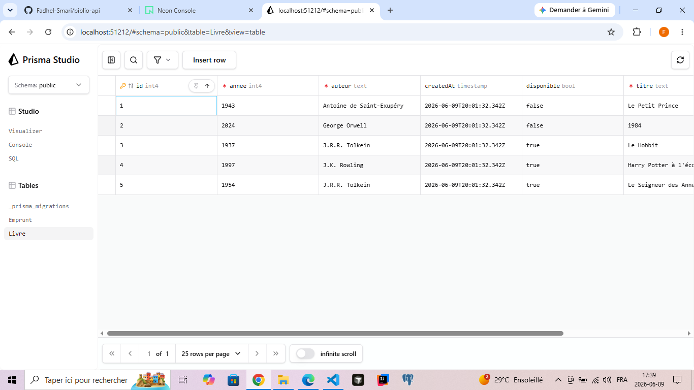
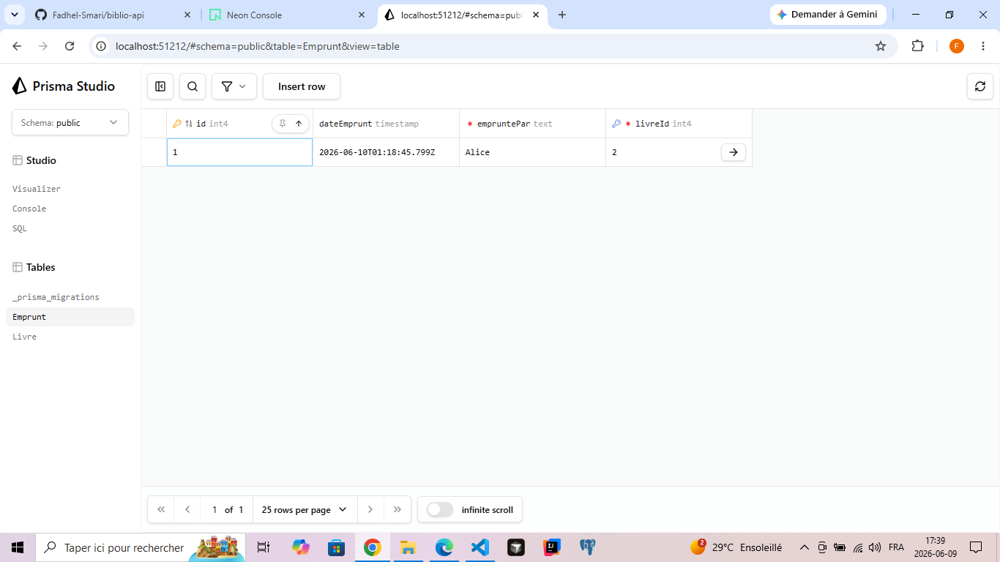

<div align="center">
<h1>Exercice de groupe– Backend Node.js</h1>
<h2>Mini-gestionnaire de bibliothèque</h2>
<h3>Prisma + Neon + TypeScript</h3>
</div>

## 👥 Équipe :
- Fadhel Smari
- Gabriel Cadieux

---

## 📝 Description du projet :
**Projet** : Un mini-backend Node.js avec TypeScript, Prisma et Neon pour gérer un catalogue de livres et leurs emprunts.

**Contexte** : Remplacement d'un tableau Excel par un système informatique pour la bibliothèque du Collège de Maisonneuve.

---

## 📌 Fonctionnalités :
* **CRUD complet** pour les livres (Création, Lecture, Mise à jour, Suppression).

* **Gestion des emprunts** avec relation 1-N (un livre peut avoir plusieurs emprunts).

* **Liste des fonctionnalités implémentées :**
    - [✔️] Lister tous les livres
    - [✔️] Lister les livres disponibles
    - [✔️] Rechercher un livre par son auteur
    - [✔️] Obtenir les détails d'un livre
    - [✔️] Marquer un livre comme indisponible
    - [✔️] Corriger l'année d'un livre
    - [✔️] Supprimer un livre
    - [✔️] Supprimer les livres antérieurs à une année
    - [✔️] Emprunter un livre
    - [✔️] Rendre un livre
    - [✔️] Lister tous les emprunts

---

## 🛠 Prérequis
- [Node.js LTS](https://nodejs.org/) (vérifiable avec `node -v`)
- [VS Code](https://code.visualstudio.com/)
- Un compte actif [Neon](https://neon.tech)
- [Git](https://git-scm.com/) pour cloner le projet

## ## 🚀 Installation
1. **Cloner le dépôt** :
   ```bash
   git clone https://github.com/Fadhel-Smari/biblio-api.git
   cd biblio-api

2. **Installer les dépendances** :
   ```bash
   npm install

3. **Configurer la base de données** :
   - Créez une base de données PostgreSQL sur Neon.
   - Copiez le contenu .env de Neon.
   - Collez-le dans le fichier `.env` à la racine du projet.

4. **Lancer la migration** :
   ```bash
   npx prisma migrate dev --name init

5. **Générer le client Prisma** :
   ```bash
    npx prisma generate

---

## 🏃 Lancer le projet

### Démarrer le script principal
```bash
npm run dev
```
### Ouvrir Prisma Studio (pour visualiser la base)
```bash
npm run db:studio
```

---
## 📸 Captures d'écran

### Table **Livre**


### Table **Emprunt**


---


